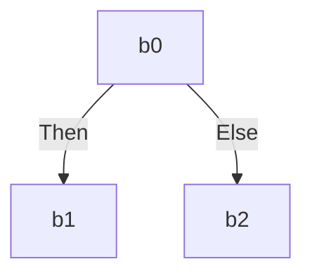
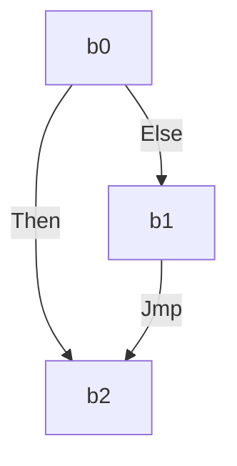
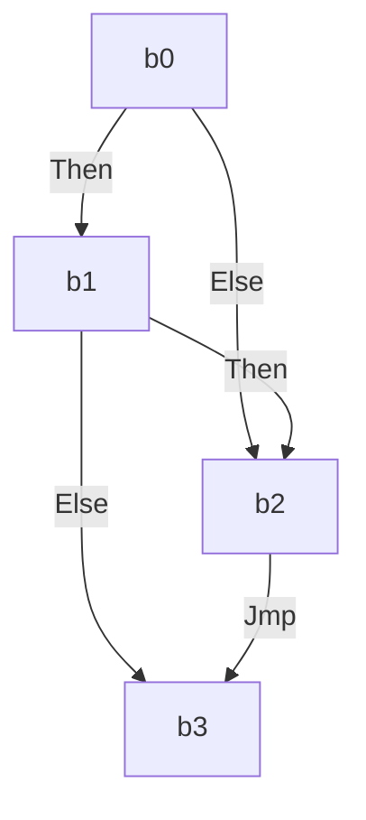
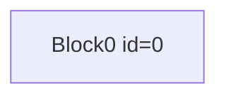
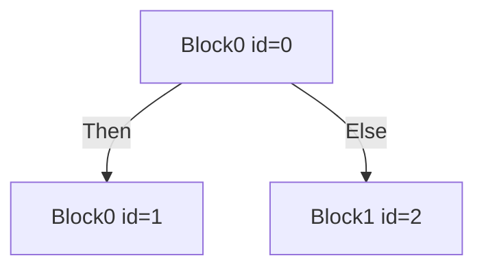
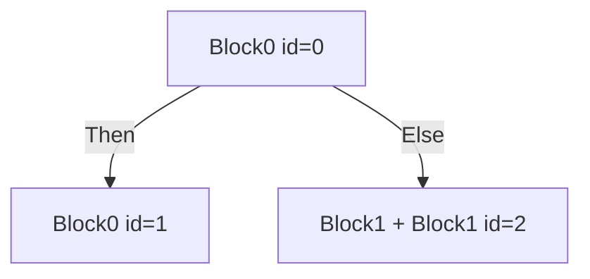
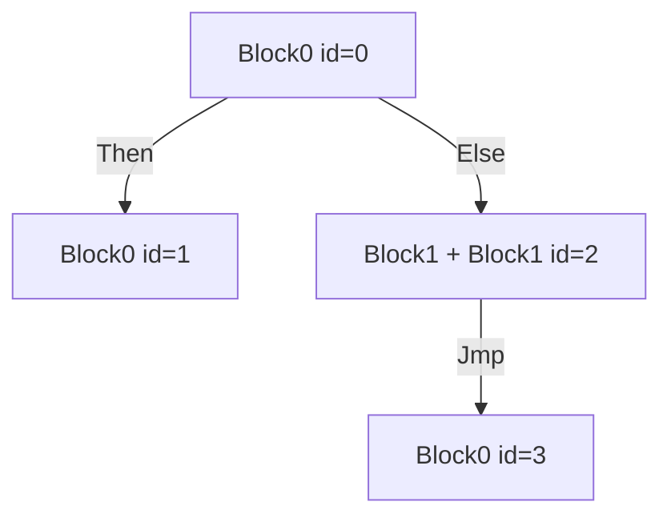
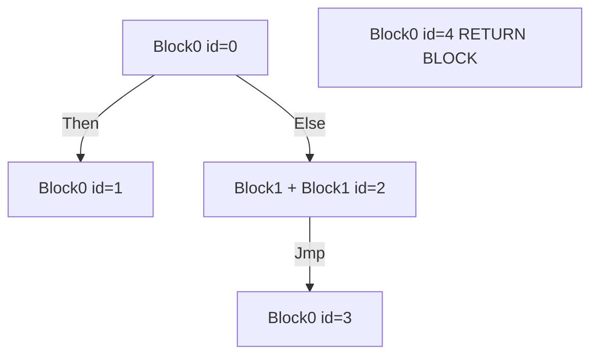
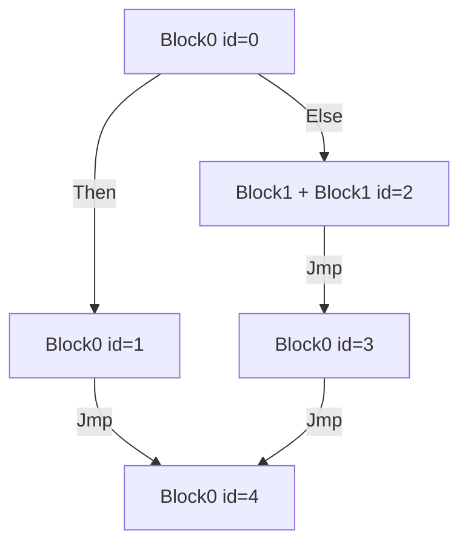

# branching

Not all programs containing branching can be solved in ACIR. 

## Rules
There are several rules:
1) There can only be one block that is terminated with `Return`;
2) Every ssa block must be terminated;
3) If block terminated with `IfElse`, `then` branch must not be the end of the branch

Due to these rules the following programs are invalid:

Because it violates either rule 1 or rule 2

Because it viloates rule 3.

And for some reason, the following program is invalid too.

It does not viloate rule 3, but invalid. (I couldn't find an explanation for this in the documentation)

## How to fuzz
Suppose the fuzzer provides blocks of instructions e.g. [Block([Add, Sub, Sub]), Block([Mul, Mul])..], 

Let's introduce new instructions for the fuzzer
1) InsertSimpleInstructionBlock(idx) -- adds instructions to `current_block_context` from stored `InstructionBlocks`
2) MergeBlocks(idx0, idx1) -- adds combination of `InstructionBlocks` into stored array of `InstructionBlocks`
3) InsertIfBlock(idx_then, idx_else) -- terminates current SSA block with `jmp_if_else`. Creates two new SSA blocks from chosen `InstructionBlocks`. Switches `current_block_context` to `then_branch`. If current SSA block is already terminated, skip.
4) InsertJmpBlock(idx) -- terminates current SSA block with `jmp`. Creates new SSA block from chosen `InstructionBlocks`. Switches `current_block_context` to new created branch. If current SSA block is already terminated, skip.
5) SwitchToBlock(idx) -- Switches `current_block_context` to chosen.
6) InsertReturnBlcok(udx) -- Must be at least 1. Creates new SSA block from chosen `InstructionBlocks`, and stores Id of this block. If such a block already exists, skip.
After all this, we termiate each notterminated block with `jmp` to `ReturnBlock`

## Example
let instruction_blocks = [Block0, Block1])]

let branching_instructions = [InsertSimpleInstructionBlock(0), InsertIfBlock(0, 1), SwitchToBlock(2), InsertSimpleInstructionBlock(1), InsertJmpBlock(0), InsertReturnBlcok(0)]

after `InsertSimpleInstructionBlock(0)`

after `InsertIfBlock(0, 1)`, current block context = 1

after `SwitchToBlock(2)`, current block context = 2

after `InsertSimpleInstructionBlock(1)`

after `InsertJmpBlock(0)`, current block context = 3

after `InsertReturnBlcok(0)`

After all the instructions have finished, we terminate each block with jmp
The resulting program will look like this:

