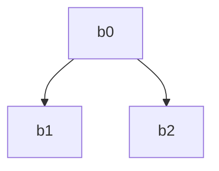
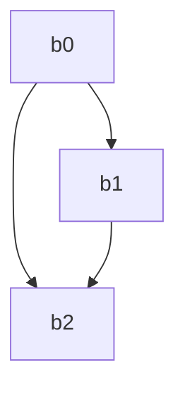

# branching

Not all programs containing branching can be solved in ACIR. 

## Rules
There are several rules:
1) There can only be one block that is terminated with `Return`;
2) Every ssa block must be terminated;
3) If block terminated with `IfElse`, `then` branch must not be the end of the branch

Due to these rules the following programs are invalid:

Because it violates either rule 1 or rule 2

